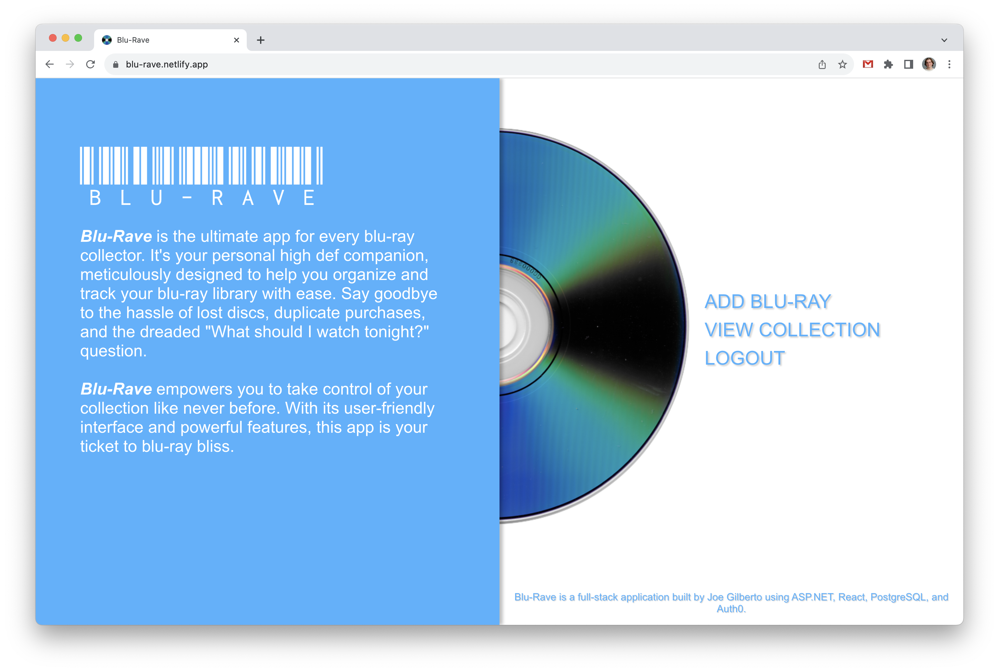
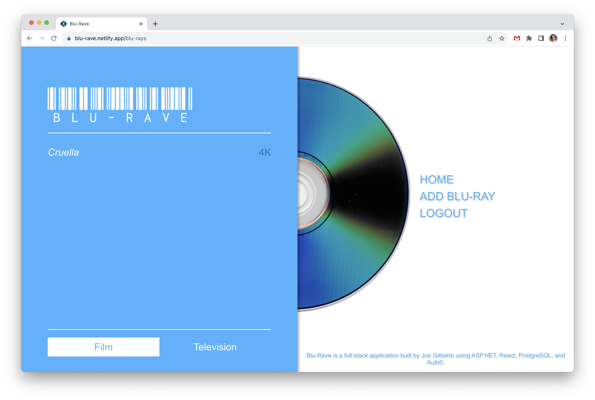
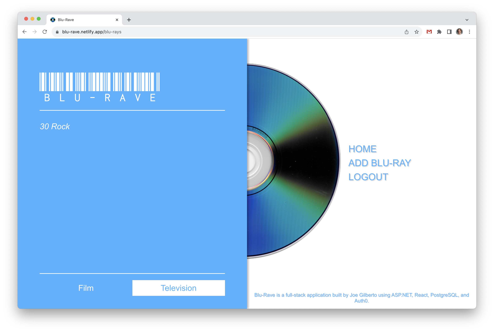
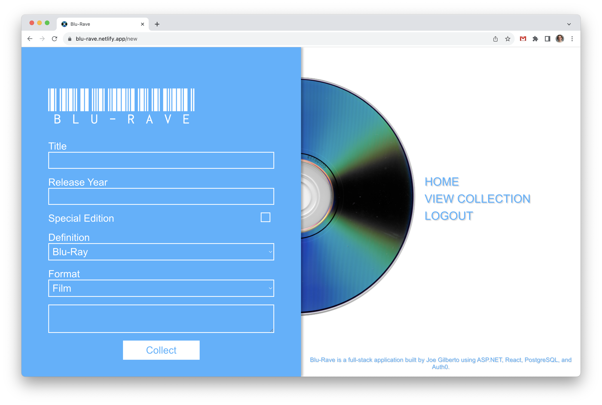
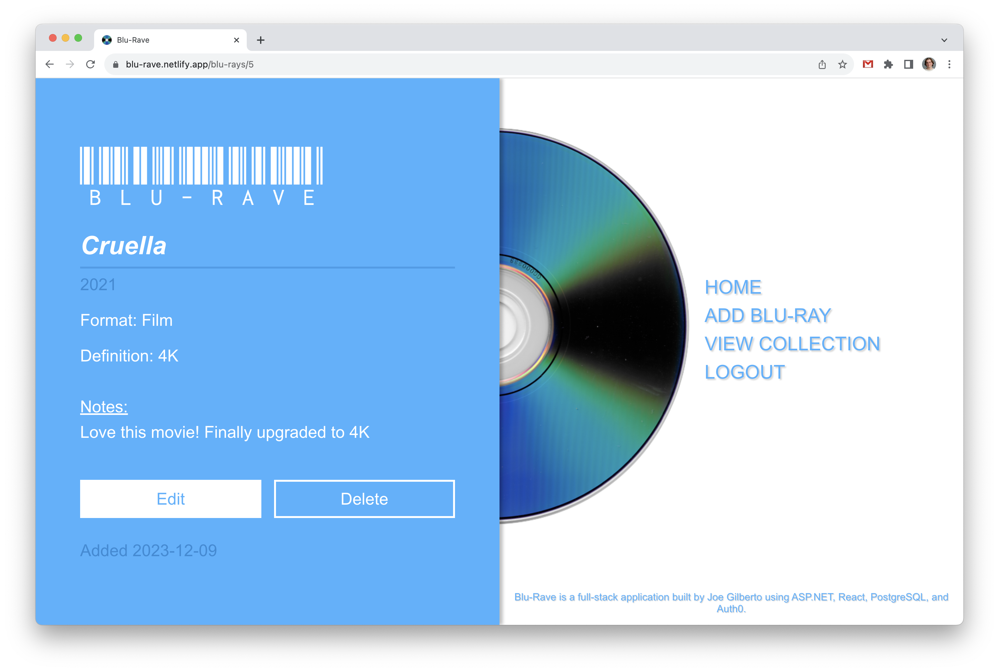
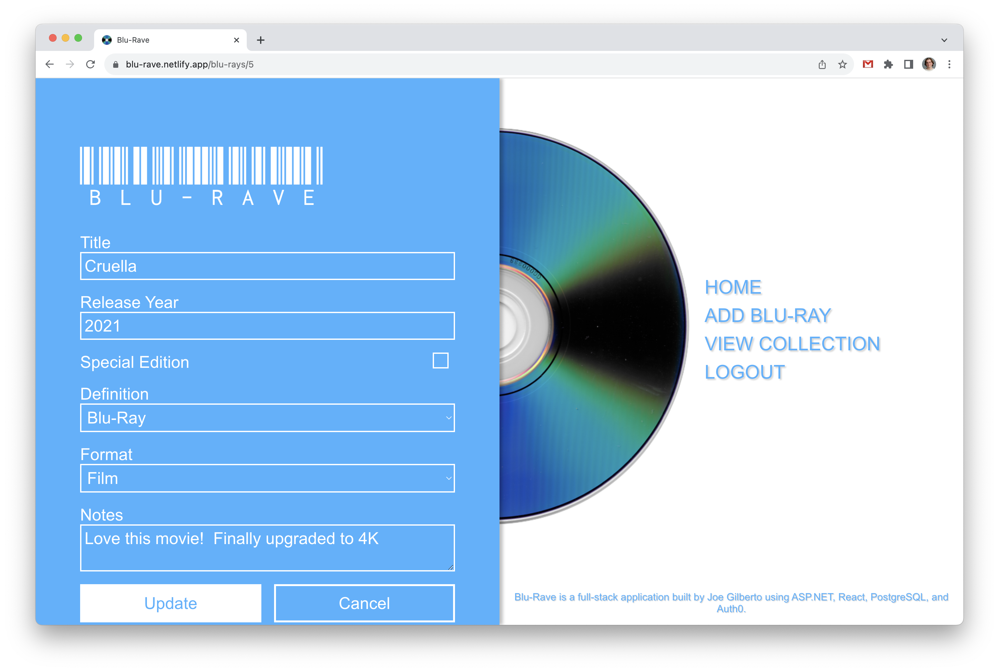

# Blu-Rave
A full-stack APS.NET/React web application that keeps track of your budding blu-ray collection.  Utilizes a React frontend Axios API calls deployed on Netlify, and a ASP.NET backend deployed on Azure that interacts with a PostgreSQL database, all authorized by Auth0.  Built by [Joe Gilberto](https://joekgilberto.com/).

## Deployment
Find the app deployed on Netlify, here: [https://blu-rave.netlify.app//](https://blu-rave.netlify.app/)

## Screenshots

### Home

As a user, I want to land on a well styiled home page when I visit the application.

### Home (Signed In)

As a user, once signed in I want to access more, authenticated options.

### Collection (Films)

As a user, I want to be able to access my blu-ray collection to view all my films.

### Collection (TV)

As a user, I want to be able to access my blu-ray collection to view all my television shows.

### New Blu-Ray

As a user, I want to be able to add blu-rays to my collections.

### Show Blu-Ray

As a user, I want to be able to see all information on individual blu-rays.

### Edit Blu-Ray

As a user, I want to be able to edit the blu-rays in my collection.

## Technologies Used

For the frontend, I utlized [React](https://react.dev/) components combined with [Axios](https://axios-http.com/) to make API calls to my backend.  My backend was built using [ASP.NET](https://dotnet.microsoft.com/en-us/apps/aspnet) and interacting with a [PostgreSQL](https://www.postgresql.org/) database.  User's are authenticated by signing in with [Auth0](https://auth0.com/).

### Resources
Below are specific relevant resources I referenced while building this application.

- [A public domain disc image from Wikimedia.](https://commons.wikimedia.org/wiki/File:RVT-R_disc_data_side_(white_background).png) that I used for the background.
- [An article from Travis Media on creating a React and .NET project in VSCode.](https://travis.media/how-to-create-react-app-net-api-vscode/)
- [An article from Francesco Ciulla on building a C# CRUD Rest API.](https://dev.to/francescoxx/c-c-sharp-crud-rest-api-using-net-7-aspnet-entity-framework-postgres-docker-and-docker-compose-493a)
- [The Auth0 quickstart guides to implement authentication and authorization.](https://auth0.com/docs/quickstarts)

## Instructions for Local Deployment
The following instructions were used through macOS with a silicone M1 chip.

### Fork and clone
To deploy locally, fork and clone this repo.

### Install .NET 7.0
First, install .NET 7.0 here: [https://dotnet.microsoft.com/en-us/download/dotnet](https://dotnet.microsoft.com/en-us/download/dotnet)

### Add service dependencies
Navigate to the service directory.  Then, add the needed dependencies below:
```
dotnet add package Microsoft.AspNetCore.Authentication.JwtBearer
```
```
dotnet add package Microsoft.AspNetCore.OpenApi
```
```
dotnet add package Microsoft.EntityFrameworkCore.Design
```
```
dotnet add package Npgsql.EntityFrameworkCore.PostgreSQL
```
```
dotnet add package Swashbuckle.AspNetCore
```

### Create a local database
Then, conenct to PostgreSQL.
```
psql 
```
Next, create a local PostgreSQL database.
```
CREATE TABLE blu_rays(
id serial PRIMARY KEY,
title TEXT,
steelbook BOOL,
definition TEXT,
format TEXT,
notes TEXT,
date_added DATE,
owner TEXT,
year INT
);
```
Then leave the PostgreSQL shell.
```
\q
```

## Create an Auth0 Application
Next, follow this Auth0 quickstart guide [(https://auth0.com/docs/quickstarts))](https://auth0.com/docs/quickstarts) to create a Backend/API you will use in your service end, selecting the ASP.NET Core Web API option, and then continue on to the Single Page App tutorial you will use in your client end, choosing the React option.


### Create service environmental variables
Still in the service directory, create environmental variables starting with your PostgreSQL connection string:
```
export CONNECTION_STRING=User ID=<your user ID>;Password=<your password>;Server=localhost;Port=5432;Database=blu;Integrated Security=true;Pooling=true;
```
Then add a secure authorization key for your token validation parameters:
```
KEY=<your secure key>;
```
Then add your Auth0 domain from your Backend/API set up:
```
AUTH0_DOMAIN=<your domain>
```
And your Auth0 audience as well:
```
AUTH0_AUDIENCE=<your audience>
```
Finally add the url for your client application, to be a whitelested CORS origin:
```
export CORS_ORIGIN=http://localhost:3000/
```

### Spin up service server
For the final step of your service set up, spin up the server with the following command:
```
 dotnet run
```

### Install client dependencies
For the first step of your client set up, navigate into your client directory via your terminal and install your dependencies.
```
npm i
```

### Create frontend environmental variables
Next, create your environmental variables:
```
touch .env.local
```
Then, add your database environmental variables to interact with your service server (running on https://localhost:7108/):
```
REACT_APP_PROD_API=https://localhost:7108/blu-rays/
REACT_APP_DOMAIN=<your domain from your SPA Auth0 app>
REACT_APP_CLIENT_ID=<your client ID from your SPA Auth0 app>
REACT_APP_AUDIENCE=<your audience from your Auth0 API>
REACT_APP_SCOPE=<your scope from your Auth0 API>
```

### Spin up your client app
Finally, while still in your client directory, spin up your app:
```
npm start
```

### Browse
Now, you can go to http://localhost:3000/ in your browser (Google Chrome is reccommended for best performance) and browse the application.

## Current User Flow
Firstly, visit [https://blu-rave.netlify.app/](https://blu-rave.netlify.app/)

From the home page, the user can read up on the application.  The user can then sign in (through an Auth0 redirect) to access the application.  After logging in, users can navigate the site throuhg the header's nav.  Through "Add Blu-Ray" they can add a blu-ray to their collection.  The user can check what blu-rays are in the collection (separated by films and TV shows) through the "View Collection" navigation link.  Users can click on individual blu-rays to view further details, edit those details, or delete the blu-ray.

## Future Features
Features to be added in further edits:
- Add a loading feature after a POST request is submitted.
- Mobile styling.
- The ability for users to share their blu-ray collections with other users.
